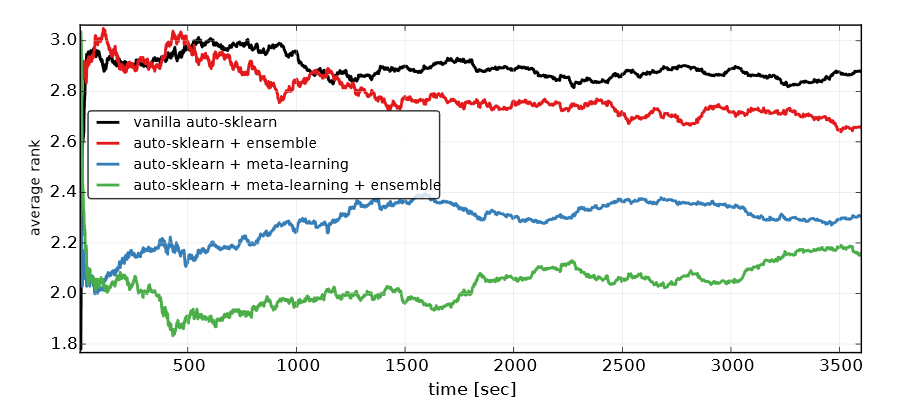

# Proposed interface for supervised learning

Okay, now that we've taken a look at some interfaces and how they well they match up with the `model`/`model family` conception of modelling, let's imagine an interface that makes operations on `model` and `model family`s feel natural in R.

## What we want out of a modelling interface

- Scientists can provide smart cross-validation schemes when appropriate
- Users can easily select and interchange hyperparameter selection methods or specify their own
- Because hyperparameter / modelling technique specific settings are handled with reasonable defaults, users can easily work with large numbers of models are the same time via a consistent and unified interface
- Ensembling is easy (in particular, I think we want it to be easy to build `SuperLearner` based packages off the provided model objects)
- Tidy and pipeable data structures
- Work primarily with `model family` objects, where hyperparameter selection is abstracted as far away from the user as possible. The less time users have to spend writing the same old hyperparameter optimization code, the easier it is for them to fall into the pit of success.
- Provide [metalearned](https://papers.nips.cc/paper/5872-efficient-and-robust-automated-machine-learning.pdf) hyperparameter values like `auto-sklearn` does (i.e. default hyperparameter search starts with hyperparameters known to work well on similar datasets)

```{r, echo = FALSE, eval = TRUE}

```

Since the `Scikit-Learn` interface is likely the most uniform and wide known interface, I think it's a good idea to use language from `Scikit-Learn` as much as possible.


## Model Instantiation

Let's demonstrate a potential interface assuming we'd like to use KNN.

In terms of implementation, I think things will be easiest if each model has a dedicated object initialization function. This function should return an object of class `"knn"`.

```{r}
knn <- new_knn()  # instantiation functions need a better name
```

But since the current paradigm in R doesn't involve instantiating model objects before fitting them, I think it would also be good to provide a wrapper called `knn` that first creates a `knn` object and then fits it. That is

```{r}
knn_family <- knn(design, data)
```

would be equivalent to 

```{r}
knn <- new_knn()
knn_family <- fit(knn, design, data)

# or, with pipes

knn_family <- new_knn() %>% 
  fit(design, data)
```

where `design`/`data` is some combination of:

- X, y (matrix, vector)
- formula, data frame
- recipe, data frame

## Model fitting

Model fitting is the most important and most complex part of the interface, and this is where I'm least happy with what's I've come up with at the moment. To fit a model, we need to specify:

- A design matrix and data
- A hyperparameter space
- A hyperparameter search algorithm
- A resampling/performance assessment strategy

I believe each of these is a major component that deserves it's own object. The `recipes` package deals with specifying data design.

There are several R packages that allow for specification of a hyperparameter space, such as `mlr`/`mlrMBO` ([details here](https://arxiv.org/pdf/1703.03373.pdf)). The tools there provide seem quite useful, but again I'm not a fan of the interface. There are a huge number of packages that do this in Python though, for example [Spearmint](https://github.com/HIPS/Spearmint).

For now, I'll pretend `hp_space()` generates a reasonable hyperparameter space object, and that `gaussian_process_opt()` is a search strategy that knows how to interface with `hp_space` objects.

I'll also assume that there is an `rsample_spec` object that specifies a resampling strategy and some performance metric used to determine which `model` has the best performance. Maybe this would turn out to be a combination of an `rsample::rset` generator with a scoring function.

To fit a `model` object, we could then do any of the following, returning an object of class `knn_model` 

```{r}
knn_model <- knn(design, data, hp_space(k = 13, metric = "euclidean"))

knn_model <- fit(new_knn(), design, data,
                 hp_space = hp_space(k = 13, metric = "euclidean"))

knn_model <- new_knn() %>% 
  add_design(recipe, data) %>% 
  add_hp_space(k = 13, metric = "euclidean") %>% 
  fit()
```

Since we are fitting a `model` rather than `model_family` here we don't need to specify a hyperparameter search algorithm or a performance assessment specification.

That is, you get a `model` back when there is a single set of hyperparameters in the `hp_space` and a `model_family` anytime the `hp_space` specifies multiple/infinite hyperparameter combinations.

To fit `model_family` objects, the following would be equivalent

```{r}
knn_family <- knn(design, data)

# and showing default arguments

knn_family <- fit(new_knn(), design, data,
                  hp_space = default_knn_hp_space,
                  hp_strategy = gaussian_process_opt,
                  resampling_strategy = default_rset_specification)
```

For users departing from the defaults, this might look like

```{r}
hyperparams <- hp_space(k = 3:4, metric = c("euclidean", "manhattan"))
resamp_spec <- resampling_spec(score = "mae", sampling = "bootstrap", reps = 10)

knn_family <- new_knn() %>% 
  add_design(recipe, data) %>% 
  add_hp_space(hyperparams) %>% 
  add_hp_search(hyperband) %>% 
  add_resampling(resamp_spec) %>% 
  fit()
```

If you wanted to do inference on the best `model` in `knn_family`, you could get it with

```{r}
best_knn_model <- extract_model(knn_family)
```


This still leaves out a bunch of details. For example (I'll update the list below as I think of more things):

- Observation weights and offsets. My thought is that `recipes` should handle this.
- A subset of the data to work on. Again, `recipes` should handle this to separate modelling fitting and data preprocessing.

## Prediction

Default predict methods should always return predictions of the same type as the input data. That is, if you specify a numeric outcome, you get a numeric prediction, if you specify a factor outcome, you get a factor prediction. This makes it easy for users to assess model performance, which is probably the first thing you want to do do after predicting.

This would look like

```{r}
predictions <- predict(knn_family, newdata)
predictions <- predict(best_knn_model, newdata)
```

For sanity and consistency with `Scikit-Learn`, I think it would be good to add a new generic `predict_proba` to get class probabilities for classification problems

```{r}
class_probs <- predict_proba(knn_family, newdata)
```

## Ensembling 

I also think the following would highly increase usability

```{r}
bagged_model  <- bag(new_lasso(), new_ridge(), new_ols(), n = 50)
stacked_model <- stack(new_lasso(), new_ridge(), new_ols(),
                       metalearner = new_glm())
boosted_model <- boost(new_lasso(), new_ridge(), new_ols(), loss = "some_loss")
```

I'm not sure if `bagged_model`, `stacked_model` and `boosted_model` are `model`s or `model_family`s, or something else entirely.
